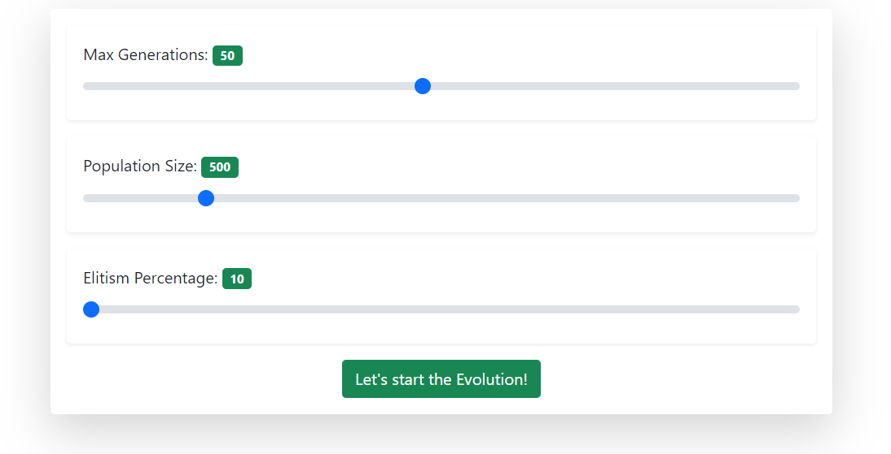

# AI Flappy Bird 🐤🤖
 This is a Flappy Bird AI game. `JavaScript` app that combines the classic __Flappy Bird__ game with a _Neural Evolution of Augmenting Topologies_ ([__NEAT__](https://en.wikipedia.org/wiki/Neuroevolution_of_augmenting_topologies)) algorithm. This project leverages the [Neataptic](https://github.com/wagenaartje/neataptic) library to teach an army of birds to play the game.

 The NEAT algorithm provides a genetic-based approach for evolving neural networks to achieve optimal performance in the game. The AI player is trained using feedback from its performance in each generation, gradually improving its ability to navigate the game.

🎮  [__Try It Out Yourself__](https://fifi000.github.io/AI-Flappy-Bird/) 🎮

 ## Starting Neural Network Architecture 🧠
 

## Overview
__Setup__

__Learning Birds__ 📗

__Top Student__ 🤓

