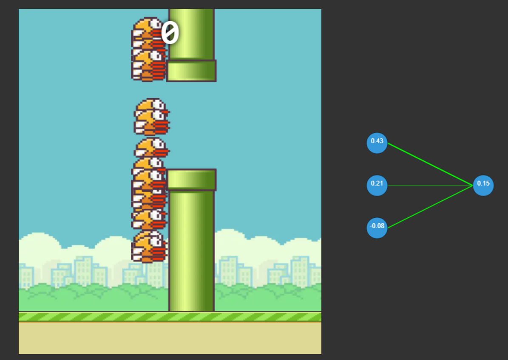
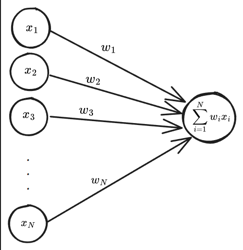
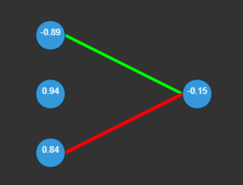
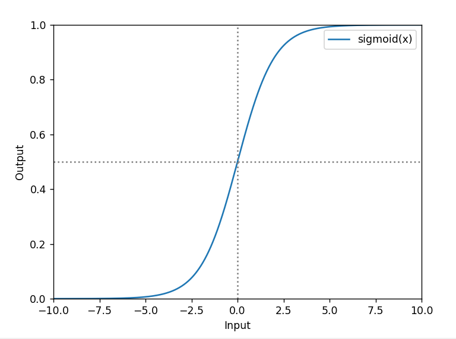

# Dokumentacja Algorytmu NEAT dla Gry Flappy Bird

## Wprowadzenie

W ptasim świecie zorganizowono igrzyska śmierci, gdzie przetrwają tylko najlepsi...

Grę rozpoczyna $250$ śmiałków a w trakcie panują zasady doboru naturalnego. Co każdą rundę jedynie garstka ($10$% nalepszych) pozostaje przy życiu i przechodzi dalej. Następnie zachodzi proces reprodukcji, żeby usupełnić brakujące $90$% wojowników, a nieudacznicy są eliminowani. Celem jest osiągnięcie $100$ punktów, co oznacza pokonanie przez któregokolwiek z grupy zawodników, $100$ przeszkód.

[Rys 1 - Demonstracja igrzysk]

### Opis Gry Flappy Bird

Celem gry Flappy Bird jest przeprowadzenie ptaka przez przeszkody, które pojawiają się na ekranie. Ptak może poruszać się tylko w górę i w dół, a przeszkody pojawiają się na różnych wysokościach. Gracz zdobywa punkt za każdą przeszkodę, którą ptak przeleci. Jeśli ptak uderzy w przeszkodę lub spadnie na ziemię, rozgrywka kończy się. 

[Rys 2 - Demonstracja gry]

## Rozwiązanie Problemu

Do osiągnięcia zamierzonego celu wykorzystano algorytm **NEAT** (ang. *Neuroevolution of Augmenting Topologies* - pl. Neuroewolucja z Rozszerzaniem Topologii), który jest jednym z rodziny **algorytmów genetycznych**. Wykorzystuje ewolucję sieci neuronowych, pozwalając na adaptacyjne trenowanie sztucznych graczy w grze Flappy Bird. Każdy sztuczny gracz jest reprezentowany przez sieć neuronową, która podejmuje decyzje (skok/nie skok) na podstawie analizy danych wejściowych.

### Genom

Sztuczna sieć neuronowa to model obliczeniowy inspirowany strukturą ludzkiego mózgu. Ludzki mózg składa się z ogromnej liczby komórek nerwowych, zwanych neuronami. Neurony działają w bardzo prosty sposób. Jeśli przychodzące bodźce są wystarczająco silne, neuron przesyła impuls elektryczny, wzdłuż swojego aksonu do innych neuronów, które są z nim połączone. Neuron działa więc jak przełącznik typu "wszystko albo nic", który przyjmuje zestaw sygnałów wejściowych i albo wysyła informajcę dalej, albo nie wysyła niczego. [Deep Learning - John D. Kelleher](). 

Modelowy neuron jest nazywany jednostką progową, a jego wartość $z$ liczona jest przy pomocy funkcji sumy:

$$
z=\sum_{i=1}^{N} {w_{i}x_{i}}
$$

gdzie $[x_{1},\dots,x_{N}]$ jest zbiorem wartości wejściowych dla $N$ połączeń, przy czym każde połączenie ma określoną wagę $[w_{1},\dots,w_{N}]$. Neuron otrzymuje dane wejściowe od wielu innych jednostek, mnoży każde wejście przez określone wagi połączeń a następnie sumuje je. [Rys 3] przedstawia strukturę sztucznego neuronu.

  
[Rys 3]

W kolejnym kroku wartość sumy ważonej $z$ dla danego neuronu przekazywana jest do określonej funkcji aktywacji. 

Sieć każdego ptaka składa się tylko z 2 warstw. Warstwa wejściowa złożona jest z 3 neuronów, natomiast warstwa wyjściowa tylko z 1. Każdy neuron w warstwie wejściowej jest połączony z neuronem wyjściowym. Poniżej na [Rys 4] widzimy przykład genomu. Wagi połączeń są oznaczone grubością linii, na zielono są wartości pozytywne, a na czerwono negatywne. Liczby w neuronach oznaczają wartości biasów. Zastosowana funcja aktywacji to sigmoida (funkcja logiczna), jej wykres przedstawia [Rys 5]. Opisuje ją równanie:

$$
f(x)=\frac{1}{1+e^{-x}}
$$

[Rys 4]

[Rys 5 - funkcja logiczna]

### Skoczyć, czy nie skoczyć?

Ewaluacja sieci dla każdego osobnika, następuje co każdą przebytą jednostkę długości. 

**Dane wejściowe**

Na wejściu do sieci neuronowej przekazywane są wartości współrzędnych $y$ dla 3 obiektów:

1. Dolej rury
2. Górnej rury
3. Ptaka

**Normalizacja**

Niech wektor $\vec{x} = [x_{1}, x_{2}, x_{3}]$ będzie wektorem wejściowym. Wartości $\vec{x}$ są normalizowe do wartości z przedziału $[-5, 5]$ przy pomocy wzoru poniżej:

$$
x_{norm}=\frac{x-x_{min}}{x_{max}-x_{min}} \cdot (target_{max}-target_{min})+target_{min}
$$

$x$ - wartość wejściowa  
$x_{min}$ - minimalna wartość wejściowa  
$x_{max}$ - maksymalna wartość wejściowa  
$target_{min}$ - minimalna wartość wyjściowa  
$target_{max}$ - maksymalna wartość wyjściowa

Znormalizowany $\vec{x}$ przekazywany jest na wejściu do sieci neuronowej. 

**Dane wyjściowe**

Po ewaluacji sieci, otrzymujemy wartość wyjściową $y$ z przedziału $[0, 1]$. Wartość ta jest porównywana z wartością progową $0.5$. Jeśli $y > 0.5$, to ptak skacze, w przeciwnym wypadku nie skacze.

### Proces ewolucji

Początkowo dla każdego osobnika zostaje przydzielony genom z pseudolosowymi wartościami wag połączeń jak i biasów. Wartości te są z przedziału $[-1,1]$. 

**Ocena skuteczności**

Z każdym kolejną przebytą jednostką długości, osobnik otrzymuje punkt (nie ten liczony na górze ekranu). Punkty te służą do oceny jakości osobnika. Im więcej punktów, tym lepszy osobnik. 

**Selekcja elity**

Jeśli w danej generacji cel pokonania $100$ przeszkód nie zostanie osiągnięty, to zostaje wybrana grupa licząca $25$ elitarnych ptaków. Jest to wartość wyliczana jako iloczyn wielkości populacji i procentu elitarności, w tym przypadku procent elitarności wynosi $0.1$. Wybrana elita przechodzi bezpośrednio do kolejnej generacji. 

**Reprodukcja**

W każdej generacji liczba zawodników jest taka sama. Po wybraniu elity, pozostaje nam $225$ osobników, którzy muszą zostać stworzeni. W pętli tworzone są nowe osobniki jako potomstwo z poprzedniej populacji.

Z każdą iteracją wybieramy losowo 2 rodziców. Na ich bazie tworzony jest nowy genom, gdzie przy każdym połączeniu oraz neuronie, losowo wybierana jest wartość jednego z rodziców, która przechodzi do potomka. Dla połączeń będzie to wartość wagi, a dla neuronów wartość biasu.

**Mutacja**

W algorytmie ustawiona wartość stopnia mutacji na $0.1$. Oznacza to, że każdy nowopowstały osobnik ma $10$% szans na mutację. Mutacja polega na wygenerowaniu nowych  wartości połączeń lub neuronów. Wartośc te, tak jak w przypadku inicjalizacji sieci, są losowane z przedziału $[-1,1]$. Dzięki zastosowaniu mutowania osobników, dostarczamy trochę świeżości do populacji. Może pozwolić to w obejściu lokalnych minimów, które mogą wystąpić w populacji. Z drugiej strony zbyt wysokie prawdopodobieństwo mutacji, może spowodować, że populacja nie będzie w stanie się nauczyć, ponieważ każdy osobnik będzie zaczynał praktycznie od zera.

**Maksymalna liczba generacji**

Dana populacja ma $50$ generacji na osiągnięcie celu. Jeśli w ciągu tych $50$ generacji nie zostanie osiągnięty cel, to zostaje wybrana nowa populacja, a proces ewolucji rozpoczyna się od nowa. Jest to wprowadzone w celu uniknięcia sytuacji, w której następuje zastój.

<!-- 
1. Dorobić wykres z osiągnięciami populacji 
    X - numer generacji
    Y - liczba punktów (score na ekranie)

2. Podsumowanie dokumentacji

3. Poprawić schemat sieci, dodać przekazanie do funkcji aktywacji

-->